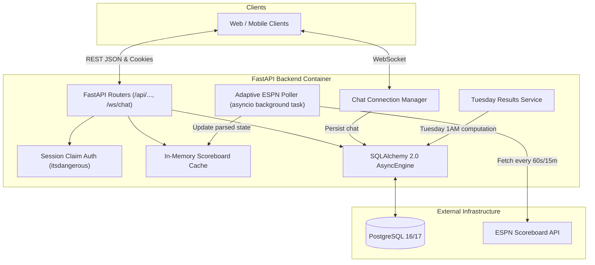

# Architectural Design Spec: Modern Async FastAPI Backend

- **Date**: 2026-09-06
- **Status**: Draft (Approved in Brainstorming)
- **Author**: Matthew Dies & Antigravity

---

## 1. Overview & Goals

This project refactors the existing Flask backend into a modern, headless **FastAPI** service running asynchronously with **Uvicorn** and **SQLAlchemy 2.0 Async**.

### Goals
1. **Headless API**: Serve JSON REST endpoints and WebSockets, completely decoupling backend logic from HTML rendering.
2. **Eliminate ESPN API Strain & Latency**: Replace synchronous per-request ESPN calls with an in-process adaptive `asyncio` background polling loop and in-memory cache, delivering sub-millisecond `/api/scoreboard` responses.
3. **Decouple Score Parsing from Database**: Eliminate the 32 database queries per page load by keeping a static in-memory team map and pure Pydantic models for scoreboard processing.
4. **Database Modernization**:
   - Separate human members (`Member`) from annual team ownership (`SeasonAssignment`).
   - Dynamically compute standings and total winnings from `WinningGame` events rather than mutating an owner record in-place.
   - Introduce `ChatMessage` persistence.
   - Establish a clean Alembic baseline migration and unified historical seed script.
5. **Claim-Based Identity & Real-Time Chat**:
   - Allow users to "claim" a member profile via a signed session cookie without requiring passwords.
   - Real-time chat powered by WebSockets (`/ws/chat`), broadcasting messages to connected clients and persisting them in PostgreSQL.
   - Server-side family-friendly profanity filter to keep chat safe.
6. **Comprehensive Automated Testing**:
   - Robust test suite using `pytest`, `pytest-asyncio`, and `httpx` covering ESPN parsing, scoreboard caching, REST endpoints, Tuesday scoring computation, and WebSocket communication.

---

## 2. System Architecture



---

## 3. Directory Layout

The application code will be structured cleanly into domain-oriented layers under `apps/football_pool`:

```text
football-pool/
├── apps/
│   └── football_pool/
│       ├── __init__.py
│       ├── main.py              # FastAPI app creation & lifespan management
│       ├── config.py            # Pydantic BaseSettings with file/env secrets
│       ├── database.py          # AsyncEngine, async_sessionmaker, Base declarative
│       ├── models/              # SQLAlchemy 2.0 models
│       │   ├── __init__.py
│       │   ├── member.py
│       │   ├── team.py
│       │   ├── assignment.py
│       │   ├── winning_game.py
│       │   ├── pot.py
│       │   └── chat.py
│       ├── schemas/             # Pydantic v2 schemas
│       │   ├── __init__.py
│       │   ├── auth.py
│       │   ├── scoreboard.py
│       │   ├── pool.py
│       │   └── chat.py
│       ├── services/            # Business logic & background tasks
│       │   ├── __init__.py
│       │   ├── espn_client.py   # Async HTTP client for ESPN API
│       │   ├── scoreboard.py    # ESPN JSON parser & in-memory cache
│       │   ├── poller.py        # Adaptive background polling loop
│       │   ├── results.py       # Tuesday scoring & pot computation
│       │   └── moderation.py    # Family-friendly chat filter
│       ├── api/                 # API route handlers
│       │   ├── __init__.py
│       │   ├── auth.py
│       │   ├── scoreboard.py
│       │   ├── pool.py
│       │   └── chat.py
│       ├── seed/                # Historical data loaders (2024, 2025)
│       │   ├── __init__.py
│       │   ├── teams_data.py
│       │   └── historical_seed.py
│       └── utils/
│           ├── __init__.py
│           ├── security.py      # itsdangerous session signer
│           └── seasons.py       # Season year math & formatting
├── migrations/                  # Alembic environment & migrations
│   ├── env.py
│   ├── script.py.mako
│   └── versions/
├── tests/                       # Automated pytest suite
│   ├── conftest.py
│   ├── fixtures/
│   │   ├── example_espn.json
│   │   └── single_event.json
│   ├── test_espn_parser.py
│   ├── test_scoreboard_cache.py
│   ├── test_api_auth.py
│   ├── test_api_pool.py
│   ├── test_chat.py
│   └── test_scoring_service.py
├── prod/
│   ├── entrypoint.sh
│   ├── prod.dockerfile
│   └── prod_docker_compose.yaml
└── pyproject.toml
```

---

## 4. Database Schema & Domain Models

### Models

#### `Member`
Represents an individual person participating in the pool.
- `id`: `int` (Primary Key, autoincrement)
- `first_name`: `str` (nullable=False)
- `last_name`: `str` (nullable=False)
- `created_at`: `datetime` (UTC, default `utcnow`)
- Relationships: `assignments` (1-to-many with `SeasonAssignment`), `chat_messages` (1-to-many with `ChatMessage`).

#### `Team`
Represents an NFL franchise (32 rows).
- `id`: `int` (Primary Key)
- `city`: `str`
- `name`: `str`
- `abbreviation`: `str(3)` (unique=True, index=True)
- `logo_url`: `str`
- `conference`: `Enum("AFC", "NFC")`
- `division`: `Enum("North", "South", "East", "West")`
- Relationships: `assignments` (1-to-many with `SeasonAssignment`), `winning_games` (1-to-many with `WinningGame`).

#### `SeasonAssignment`
Maps an NFL team to a pool member for a specific season.
- `id`: `int` (Primary Key, autoincrement)
- `season_year`: `int` (nullable=False, index=True)
- `member_id`: `int` (ForeignKey `members.id`, nullable=False)
- `team_id`: `int` (ForeignKey `teams.id`, nullable=False)
- Constraints: `UniqueConstraint("season_year", "team_id")` ensures a team can only be assigned once per season.

#### `WinningGame`
Records a payout event for a team during a specific week.
- `id`: `int` (Primary Key, autoincrement)
- `season_year`: `int` (nullable=False, index=True)
- `week`: `int` (nullable=False)
- `winnings`: `int` (nullable=False, amount in dollars)
- `winning_type`: `Enum("MOST", "LEAST", "FIFTY", "PLAYOFF", "SUPER_BOWL")`
- `team_id`: `int` (ForeignKey `teams.id`, nullable=False)

#### `Pot`
Tracks the current rolling pot.
- `id`: `int` (Primary Key, autoincrement)
- `season_year`: `int` (nullable=False, unique=True)
- `amount`: `int` (nullable=False, default=10)

#### `ChatMessage`
Stores chat messages.
- `id`: `int` (Primary Key, autoincrement)
- `member_id`: `int` (ForeignKey `members.id`, nullable=False)
- `content`: `str` (nullable=False, max length 500)
- `created_at`: `datetime` (UTC, index=True, default `utcnow`)

---

## 5. Standings & Winnings Calculation

Rather than updating a balance column on `Member` or `SeasonAssignment`, member winnings are aggregated dynamically:
```sql
SELECT 
    m.id AS member_id,
    m.first_name,
    m.last_name,
    t.abbreviation AS team_abbreviation,
    t.name AS team_name,
    COALESCE(SUM(wg.winnings), 0) AS total_winnings
FROM members m
JOIN season_assignments sa ON sa.member_id = m.id AND sa.season_year = :season_year
JOIN teams t ON t.id = sa.team_id
LEFT JOIN winning_games wg ON wg.team_id = sa.team_id AND wg.season_year = sa.season_year
GROUP BY m.id, m.first_name, m.last_name, t.abbreviation, t.name
ORDER BY total_winnings DESC, m.last_name ASC;
```

---

## 6. ESPN Polling, Caching & Tuesday Scoring

### In-Memory Team Cache
At startup, the application loads all 32 `Team` records into an in-memory dictionary `dict[str, TeamSchema]`, keyed by abbreviation (`"KC"`, `"PIT"`, etc.).

### Scoreboard Data Models (Pydantic)
- `ScoreboardGame`:
  - `id`: `str`
  - `home_team`: `TeamSummary` (abbreviation, city, name, logo_url)
  - `home_team_score`: `int`
  - `away_team`: `TeamSummary`
  - `away_team_score`: `int`
  - `status`: `GameStatus` (`STATUS_SCHEDULED`, `STATUS_IN_PROGRESS`, `STATUS_HALFTIME`, `STATUS_FINAL`)
  - `display_clock`: `str | None`
  - `quarter`: `int | None`
  - `gametime`: `datetime`
  - `espn_url`: `str`
- `ScoreboardWeek`:
  - `season_year`: `int`
  - `season_type`: `SeasonType` (`PRESEASON`, `REGULAR_SEASON`, `POSTSEASON`)
  - `week`: `int`
  - `winning_type`: `WinningType` (Odd week = `MOST`, Even week = `LEAST`, Postseason = `PLAYOFF`, Super Bowl = `SUPER_BOWL`)
  - `games`: `list[ScoreboardGame]`
  - `pool_winning_team_abbrs`: `list[str]`
  - `pot_amount`: `int`
  - `last_polled_at`: `datetime`

### Adaptive Polling Logic
An async loop runs inside the FastAPI Lifespan:
1. Fetch latest scoreboard JSON from ESPN scoreboard endpoint via `httpx.AsyncClient`.
2. Parse JSON using pure Pydantic parsing (using the in-memory team map).
3. Compute `pool_winning_team_abbrs` according to game rules.
4. Read current `pot.amount` from DB.
5. Update `ScoreboardCache` in memory.
6. Determine next sleep interval:
   - If any game has status `STATUS_IN_PROGRESS` or `STATUS_HALFTIME`: **60 seconds**.
   - If any game starts within the next 2 hours or is scheduled today: **300 seconds (5 minutes)**.
   - If all games are `STATUS_FINAL` or week is inactive: **900 seconds (15 minutes)**.
   - Off-season (outside August - February): **3600 seconds (1 hour)**.
7. An `asyncio.Event` allows `POST /api/scoreboard/refresh` to wake the poller immediately.

### Tuesday Weekly Resolution Service
Runs every Tuesday at 1:00 AM EST (via background task or on-demand maintenance endpoint):
1. Loads the finalized games for the current week.
2. Identifies winners:
   - Regular season: most or least points scorer(s).
   - Postseason: all winning teams.
   - Super Bowl: champion team.
   - 50-point scorers: any team scoring 50+ points ($50).
3. Checks if winners are owned by any member in `season_assignments` for the season:
   - If an owner won regular season: payout equals current pot; pot resets to $10.
   - If no owner won: pot increases by $10.
4. Idempotently inserts `WinningGame` rows if not already present for `(season_year, week)`.

---

## 7. Authentication, Claim Model & REST API

### Claim Authentication
- `POST /api/auth/claim`:
  - Request body: `{"member_id": int}`
  - Validates `member_id` exists in `members` table.
  - Generates a signed token with `itsdangerous.URLSafeSerializer` using `Config.SECRET_KEY`.
  - Sets HTTP-only cookie `fp_session` with `max_age=31536000` (1 year), `samesite="lax"`, `secure=not config.DEBUG`.
- `GET /api/auth/me`:
  - Reads `fp_session` cookie. If valid, returns claimed member info and current season team assignment. If not claimed, returns `{"claimed": false}`.
- `POST /api/auth/unclaim`:
  - Clears `fp_session` cookie.

### REST Endpoints
| Endpoint | Method | Response |
|----------|--------|----------|
| `/healthcheck` | `GET` | `{"status": "ok"}` |
| `/api/members` | `GET` | `list[MemberResponse]` |
| `/api/auth/claim` | `POST` | `MemberResponse` |
| `/api/auth/me` | `GET` | `AuthMeResponse` |
| `/api/auth/unclaim` | `POST` | `{"status": "unclaimed"}` |
| `/api/scoreboard` | `GET` | `ScoreboardResponse` (from in-memory cache) |
| `/api/scoreboard/refresh` | `POST` | `ScoreboardResponse` (forces refresh) |
| `/api/pool/seasons` | `GET` | `SeasonsResponse` (`current_season`, `tracked_seasons`) |
| `/api/pool/assignments` | `GET` | `list[SeasonAssignmentResponse]` (filter by `season_year`) |
| `/api/pool/results` | `GET` | `PoolResultsResponse` (`weekly_winners`, `standings`) |
| `/api/pool/pot` | `GET` | `PotResponse` (`season_year`, `amount`) |
| `/api/chat/history` | `GET` | `list[ChatMessageResponse]` (limit, offset) |

---

## 8. Real-Time Chat & Family-Friendly Moderation

### Moderation Filter
- Incoming message content is inspected against a profanity wordlist (powered by `better-profanity`).
- Inappropriate terms are replaced with asterisks (`****`) to preserve conversation flow while strictly keeping the chat family-friendly.
- Messages are capped at 500 characters and stripped of leading/trailing whitespace. Empty messages are rejected.

### WebSocket `/ws/chat`
- **Handshake**:
  - Checks `fp_session` cookie.
  - If valid: registers connection with `member_id` and full name.
  - If missing/invalid: connection is accepted in **read-only** mode.
- **Protocol**:
  - Client sends JSON: `{"content": "Go Bills!"}`
  - Server verifies sender is not read-only.
  - Server sanitizes and censors content.
  - Server asynchronously inserts record into `chat_messages` table.
  - Server broadcasts JSON to all connected clients:
    ```json
    {
      "type": "chat_message",
      "id": 105,
      "member_id": 4,
      "author_name": "Dave Hasman",
      "content": "Go Bills!",
      "created_at": "2026-09-06T23:45:00Z"
    }
    ```
- **Connection Management**:
  - `ChatConnectionManager` manages active WebSockets, isolates send errors, and unregisters dropped sockets automatically.

---

## 9. Testing Strategy

All automated tests will be executable via `pytest` with `pytest-asyncio` using in-memory SQLite (`sqlite+aiosqlite:///:memory:`):

1. **`test_espn_parser.py`**:
   - Parses `example_espn.json` and `single_event.json` without internet access.
   - Tests `GameStatus` enum fallbacks, clock formats, and overtime.
   - Validates odd/even week logic (most points vs least points).
   - Validates 50-point scorer detection.
   - Validates postseason and Super Bowl winner extraction.
2. **`test_scoreboard_cache.py`**:
   - Tests initial cache load, get, and manual refresh trigger.
   - Tests adaptive interval calculation logic across in-progress, final, and idle games.
3. **`test_api_auth.py`**:
   - Tests claiming valid and invalid member IDs.
   - Tests cookie forgery and tampering protection.
   - Tests `/api/auth/me` with and without cookie.
   - Tests unclaiming.
4. **`test_api_pool.py`**:
   - Tests `/api/pool/seasons`.
   - Tests assignments listing for 2024 and 2025.
   - Tests standings calculation (verifying dynamic aggregation equals historical records).
   - Tests pot retrieval.
5. **`test_chat.py`**:
   - Tests `/api/chat/history` pagination and order.
   - Tests WebSocket connection with claimed cookie.
   - Tests WebSocket connection in read-only mode (unclaimed).
   - Tests profanity filtering and asterisk replacement.
   - Tests broadcasting to multiple concurrent WebSocket clients.
   - Tests database persistence of chat messages.
6. **`test_scoring_service.py`**:
   - Tests Tuesday resolution when an owner wins.
   - Tests Tuesday resolution when no owner wins (pot incrementation by $10).
   - Tests resolution idempotency (calling twice does not duplicate payouts).

---

## 10. Containerization & Deployment

- **Base Image**: Python 3.14-alpine with `uv`.
- **Server**: `uvicorn apps.football_pool.main:app --host 0.0.0.0 --port ${WEB_PORT} --lifespan on`.
- **Migrations**: `alembic upgrade head` executed in `prod/entrypoint.sh`.
- **Secrets**: `Config` checks `/run/secrets/` files first, with fallbacks to environment variables (`DATABASE_URL`, `APP_SECRET_KEY`, etc.) for local execution.
