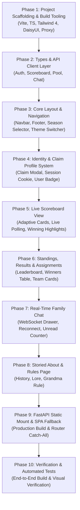

# Architectural Design Spec: Modern Reactive Frontend & Real-Time Client

- **Date**: 2026-09-07
- **Status**: Draft (Proposal for Review)
- **Author**: Matthew Dies & Antigravity

---

## 1. Overview & Goals

Following the successful migration of the Football Pool backend to a headless **FastAPI** service with in-memory scoreboard caching, claim-based identity, and WebSocket chat, the next step is refactoring and rewriting the front-end.

The legacy front-end relied on server-side rendered Jinja2 templates and legacy HTMX snippets. This refactor replaces the legacy frontend with a modern, high-performance **Single Page Application (SPA)** that natively integrates with the FastAPI REST API and real-time WebSocket endpoints.

### Core Goals
1. **Modern Component-Driven SPA**: Replace server-side Jinja2 templates with a modern, fast, and responsive frontend built with **Vite**, **TypeScript**, **Tailwind CSS**, and **DaisyUI**.
2. **Real-Time Live Scoreboard**:
   - Render live game cards with instantaneous status updates (Scheduled, In-Progress, Halftime, Final).
   - Automatically highlight teams currently meeting the weekly winning condition (e.g. Most Points, Least Points, 50-Point Bonus).
   - Clearly display which family member owns each playing team directly on the game cards.
   - Background polling with visual pulse indicator and manual on-demand refresh button.
3. **Seamless Profile Claiming & Identity**:
   - Intuitive "Claim Profile" modal allowing members to select their name.
   - Persisted session state via HTTP-only cookie (`fp_session`) communicating with `/api/auth/claim` and `/api/auth/me`.
   - Personalized UI showing the user's assigned NFL team, winnings, and chat handle across all pages.
4. **Interactive Real-Time Family Chat**:
   - Slide-out drawer / floating panel connecting directly to `/ws/chat`.
   - Instant bi-directional messaging with optimistic UI updates and auto-scroll.
   - Unclaimed / read-only mode with friendly call-to-action to claim a name.
   - Robust WebSocket reconnection logic with exponential backoff.
5. **Standings, Results & Assignments Explorer**:
   - Season selector supporting current and historical seasons (2024, 2025+).
   - Season leaderboard with standings, medals, and total winnings.
   - Chronological weekly winners log.
   - Filterable assignments grid (by conference, division, owner, or team).
6. **Preserved Rich Lore & Rules**:
   - Dedicated "About & Rules" page celebrating the storied history of the **UCMFPTDCYAMBCMYR** ("Uncle Charles Memorial Football Pool That Doesn't Cost You Any Money But Can Make You Rich").
7. **Unified Production Deployment**:
   - Multi-stage Docker build producing an optimized static bundle served directly by FastAPI with client-side SPA routing fallback.

---

## 2. Technology Stack Selection

| Layer | Selected Tech | Rationale |
|---|---|---|
| **Build Tool** | **Vite** | Sub-second HMR during development, lightning-fast ESBuild/Rollup builds. |
| **Framework** | **React 18 / 19 + TypeScript** | Rich component ecosystem, strict type alignment with backend Pydantic models, intuitive hook-based state management for WebSocket lifecycles. |
| **Styling** | **Tailwind CSS v4 + DaisyUI** | Continues Matt's preferred component library, providing consistent themes, cards, modals, and responsive layout utilities. |
| **Icons** | **Lucide Icons** (`lucide-react`) | Crisp, lightweight, modern iconography for live badges, sports icons, user avatars, and themes. |
| **Routing** | **React Router v6 / Wouter** | Lightweight client-side navigation between Scoreboard, Results, Assignments, and About. |
| **HTTP & WS Client** | Native `fetch` + Custom typed API Client | Zero-dependency, lightweight REST calls and native `WebSocket` wrapper. |

---

## 3. Directory Layout

The frontend source code will reside in `frontend/` at the repository root, with built assets outputted to `apps/football_pool/static/dist/` for FastAPI to serve:

```text
football-pool/
├── frontend/                        # Frontend source code
│   ├── index.html                   # HTML entrypoint
│   ├── package.json                 # Node dependencies and scripts
│   ├── vite.config.ts               # Vite config with /api and /ws proxy
│   ├── tsconfig.json                # TypeScript compiler config
│   ├── src/
│   │   ├── main.tsx                 # App mount & router provider
│   │   ├── App.tsx                  # Root layout (Navbar, Page content, ChatDrawer, ClaimModal)
│   │   ├── index.css                # Tailwind CSS v4 & DaisyUI styles
│   │   ├── types/                   # TypeScript interfaces mirroring Pydantic schemas
│   │   │   ├── auth.ts
│   │   │   ├── scoreboard.ts
│   │   │   ├── pool.ts
│   │   │   └── chat.ts
│   │   ├── api/                     # Typed REST API clients
│   │   │   ├── client.ts            # Base fetch wrapper with credentials
│   │   │   ├── authApi.ts
│   │   │   ├── scoreboardApi.ts
│   │   │   ├── poolApi.ts
│   │   │   └── chatApi.ts
│   │   ├── hooks/                   # Reactive state hooks
│   │   │   ├── useAuth.ts           # Claimed user state & claim/unclaim methods
│   │   │   ├── useScoreboard.ts     # Live polling, manual refresh, game states
│   │   │   ├── useChatWebSocket.ts  # WebSocket connection, reconnection, message feed
│   │   │   ├── useSeasons.ts        # Season switcher & assignments/results state
│   │   │   └── useTheme.ts          # DaisyUI theme toggle & localStorage persistence
│   │   ├── components/
│   │   │   ├── layout/
│   │   │   │   ├── Navbar.tsx
│   │   │   │   ├── Footer.tsx
│   │   │   │   └── SeasonSelector.tsx
│   │   │   ├── scoreboard/
│   │   │   │   ├── ScoreboardHeader.tsx
│   │   │   │   ├── GameCard.tsx
│   │   │   │   ├── TeamScoreRow.tsx
│   │   │   │   └── GameStatusBadge.tsx
│   │   │   ├── results/
│   │   │   │   ├── StandingsTable.tsx
│   │   │   │   ├── WeeklyWinnersTable.tsx
│   │   │   │   └── PotCard.tsx
│   │   │   ├── assignments/
│   │   │   │   ├── AssignmentCard.tsx
│   │   │   │   └── AssignmentFilters.tsx
│   │   │   ├── chat/
│   │   │   │   ├── ChatDrawer.tsx
│   │   │   │   ├── ChatMessageItem.tsx
│   │   │   │   └── ChatInput.tsx
│   │   │   ├── auth/
│   │   │   │   └── ClaimProfileModal.tsx
│   │   │   └── common/
│   │   │       ├── ThemeToggle.tsx
│   │   │       ├── LoadingSpinner.tsx
│   │   │       └── AlertBadge.tsx
│   │   └── pages/
│   │       ├── ScoreboardPage.tsx   # Live game cards & weekly pot
│   │       ├── ResultsPage.tsx      # Standings & weekly winners
│   │       ├── AssignmentsPage.tsx  # NFL team ownership
│   │       └── AboutPage.tsx        # Storied history & league rules
│   └── public/
├── apps/
│   └── football_pool/
│       ├── main.py                  # Mounts static files & SPA fallback router
│       └── static/
│           ├── logos/               # NFL logos transparent pngs
│           └── dist/                # Production build artifacts
```

---

## 4. UI/UX & Page Specifications

### 4.1 Global Layout & Navbar
- **Brand Title**: `UCMFPTDCYAMBCMYR` (with hover tooltip or subtitle: *"Uncle Charles Memorial Football Pool That Doesn't Cost You Any Money But Can Make You Rich"*).
- **Navigation Links**:
  - **Live Scores** (`/`)
  - **Standings & Results** (`/results`)
  - **Assignments** (`/assignments`)
  - **About & Rules** (`/about`)
- **Actions Area**:
  - **Season Selector**: Dropdown showing tracked seasons (e.g. `2025-2026`, `2024-2025`).
  - **Live Chat Trigger**: Floating button or navbar icon with unread message counter badge.
  - **User Profile / Claim Badge**:
    - If claimed: displays member name, avatar initials, and their assigned NFL team logo. Clicking opens a dropdown with "Unclaim / Switch Profile".
    - If unclaimed: displays prominent "Claim Profile" button triggering the Claim Modal.
  - **Theme Controller**: Swap between dark (`dim` or `dark`) and light (`nord` or `light`) DaisyUI themes, stored in `localStorage`.

---

### 4.2 Live Scoreboard Page (`/`)
- **Header Banner**:
  - Current NFL Week (`Week 1`, `Week 2`, etc.).
  - Weekly Winning Rule explanation with visual badge:
    - *Odd weeks*: **Most Points Week** ($10 payout).
    - *Even weeks*: **Least Points Week** ($10 payout).
    - *Postseason*: **Playoff Win Week** ($10 per win).
    - *Super Bowl*: **Championship Week** ($25 payout).
    - Bonus badge: **50+ Point Bonus ($50)**.
  - Rolling Pot amount card (e.g., `Current Pot: $10`).
  - Refresh controls:
    - Pulsing green dot: *"Live polling active"*.
    - Last updated timestamp (e.g., *"Updated 12s ago"*).
    - Manual refresh button with spinning icon.
- **Game Cards Grid**:
  - Cards adapt to game statuses:
    - **Scheduled**: Kickoff date & time formatted in user's local timezone (e.g., *"Sun 1:00 PM EST"*).
    - **In-Progress**: Live badge, game clock & quarter (e.g., *"10:24 Q2"*), real-time scores.
    - **Halftime**: Halftime status badge, scores.
    - **Final**: Final status badge, final scores.
  - **Winning Highlights**:
    - Games where a team currently holds the winning condition (e.g. highest points or least points) feature a soft success border/glow.
    - Displays the owner's name next to the team (e.g., *"Kansas City Chiefs (Matt Dies)"*).
  - Clicking any card opens the official ESPN Gamecast page in a new browser tab.

---

### 4.3 Standings & Results Page (`/results`)
- **Season Filter**: Tabs or dropdown to view historical seasons.
- **Current Pot Display**: Prominent banner showing total pot for the selected season.
- **Season Standings Table**:
  - Rank, Member Name, Assigned Team (with logo), and Total Winnings ($).
  - Medals for 1st (🥇), 2nd (🥈), and 3rd (🥉) places.
  - Highlights the row corresponding to the currently claimed user.
- **Weekly Winners Log**:
  - Chronological breakdown of each resolved week.
  - Week number, Winning Team (with logo), Member Owner, Rule Type, and Winnings amount ($).
  - Clean empty-state banner when no games have resolved yet for the season.

---

### 4.4 Team Assignments Page (`/assignments`)
- **Season Filter**: Switch between 2024, 2025, etc.
- **Search & Filter Bar**: Filter by member name, team city/name, conference (AFC / NFC), or division (East, North, South, West).
- **Team Grid**:
  - 32 cards displaying team helmet/logo, team name, conference/division badge, and assigned owner name.
  - Clickable link to ESPN team stats.
  - Visual accent on the claimed user's assigned team.

---

### 4.5 About & Rules Page (`/about`)
- **Storied League History**:
  - Uncle Charles in the 1980s, Grandma & Grandpa reviving the league.
  - Lobster & steak dinner selection party tradition.
  - CPA-certified blind drawings and the famous deck wind gust.
  - Aunt Katherine's league shirts.
- **Official League Rules**:
  - Alternating Most/Least point weeks.
  - $10 weekly payouts, $50 bonus for 50-point games, $10 playoff payouts, $25 Super Bowl champion payout.
  - **The Golden Grandma Rule**: *"If you win, you have to call Grandma and tell her: 'Show me the money!!'"*
  - Fun note on Matt's pending $10,000 developer bonus.

---

### 4.6 Profile Claiming System (`ClaimProfileModal`)
- Triggered automatically if the user is unclaimed, or manually via navbar.
- Fetches all pool members from `GET /api/members`.
- Searchable dropdown: *"Select your name"*.
- Submits `POST /api/auth/claim` with `member_id`.
- On success: updates auth state, shows success toast (*"Welcome, [Name]! You own the [Team]"*), and closes modal.
- Includes quick "Unclaim / Change Member" option in the user menu.

---

### 4.7 Real-Time Live Chat Drawer (`ChatDrawer`)
- Slide-out drawer or docked panel accessible from any page.
- **Connection Management**:
  - Connects to `/ws/chat`.
  - Automatically loads last 50 messages on mount via `GET /api/chat/history`.
  - Reconnects automatically with exponential backoff on disconnect.
  - Shows connection status badge (*"Connected"* / *"Connecting..."*).
- **Message Feed**:
  - Bubble layout with author name, timestamp, and message content.
  - Messages from claimed user highlighted on the right; other members on the left.
  - Profanity filtering handled seamlessly by backend.
  - Unread badge on chat button when drawer is closed.
- **Chat Input**:
  - If claimed: text input with 500-character limit, send button, Enter-to-submit.
  - If unclaimed: disabled input with friendly CTA: *"Claim your profile in the top-right to join the chat!"*

---

## 5. Backend Integration & Production Deployment

### 5.1 FastAPI Static Serving & SPA Fallback
To keep deployment unified in a single container, FastAPI in `apps/football_pool/main.py` will serve the built SPA assets:

```python
# In apps/football_pool/main.py
from fastapi.staticfiles import StaticFiles
from fastapi.responses import FileResponse
import os

# Mount static files (logos, favicons, build assets)
app.mount("/static", StaticFiles(directory="apps/football_pool/static"), name="static")

# SPA catch-all fallback for client-side routing
@app.get("/{full_path:path}", include_in_schema=False)
async def serve_spa(full_path: str):
    # Don't intercept API or WS routes
    if full_path.startswith(("api/", "ws/", "docs", "redoc", "openapi.json")):
        raise HTTPException(status_code=404)
    
    dist_index = "apps/football_pool/static/dist/index.html"
    if os.path.exists(dist_index):
        return FileResponse(dist_index)
    return FileResponse("apps/football_pool/templates/index.html")
```

### 5.2 Multi-Stage Dockerfile
Update `prod/prod.dockerfile` with a lightweight Node build stage:

```dockerfile
# Stage 1: Build Frontend SPA
FROM node:22-alpine AS frontend-builder
WORKDIR /app/frontend
COPY frontend/package*.json ./
RUN npm ci
COPY frontend/ ./
RUN npm run build

# Stage 2: Python Production Container
FROM python:3.13-alpine
# ... existing python & uv setup ...
COPY --from=frontend-builder /app/apps/football_pool/static/dist /apps/football_pool/apps/football_pool/static/dist
# ... copy python app & run uvicorn ...
```

---

## 6. Execution Plan & Phased Implementation



### Phase 1: Project Scaffolding & Build Tooling
- Initialize Vite + React + TypeScript in `frontend/`.
- Configure Tailwind CSS v4 and DaisyUI plugins.
- Set up Vite proxy for `/api` and `/ws` pointing to `http://localhost:5600`.
- Add build scripts to root `package.json` (`npm run build:frontend`, `npm run dev:frontend`).

### Phase 2: Types & API Client Layer
- Define TypeScript interfaces matching Pydantic models:
  - `MemberResponse`, `AuthMeResponse`.
  - `ScoreboardResponse`, `ScoreboardGame`, `TeamSummary`.
  - `PoolResultsResponse`, `SeasonAssignmentResponse`, `PotResponse`.
  - `ChatMessageResponse`, `WSChatMessage`.
- Implement lightweight fetch client with credentials support (`credentials: "include"`).

### Phase 3: Core Layout & Navigation
- Build responsive `Navbar` with mobile drawer and active route indicators.
- Implement DaisyUI theme controller (light / dark mode) with `localStorage` sync.
- Create `SeasonSelector` component hooked to tracked seasons.
- Build clean footer with copyright, links, and attribution.

### Phase 4: Identity & Claim Profile System
- Implement `useAuth` hook tracking `/api/auth/me`.
- Build `ClaimProfileModal` fetching member roster from `/api/members`.
- Implement claim action with immediate header refresh and team assignment display.
- Add unclaim dropdown action.

### Phase 5: Live Scoreboard View
- Build `ScoreboardPage` with weekly rule banner and rolling pot display.
- Implement responsive `GameCard` supporting Scheduled, In-Progress, Halftime, and Final states.
- Add winning team visual highlight logic (`pool_winning_team_abbrs`).
- Implement polling interval hook with manual refresh button and loading state.

### Phase 6: Standings, Results & Assignments Views
- Build `ResultsPage`:
  - Season leaderboard with standings ranking and medal badges.
  - Weekly winners table.
- Build `AssignmentsPage`:
  - 32 NFL team grid with logos, conference badges, and owner names.
  - Search & filter by team or member name.

### Phase 7: Real-Time Family Chat
- Implement `useChatWebSocket` hook with auto-connect, message history loading, and ping/reconnect.
- Build slide-out `ChatDrawer` component accessible from any page.
- Add message list with sender bubble styles and timestamp formatting.
- Add chat input with character counter and read-only banner for unclaimed visitors.
- Add unread message indicator badge on chat trigger button.

### Phase 8: About & Rules View
- Build `AboutPage` with engaging typography and styled cards for history and league rules.
- Include Grandma & Grandpa lore, steak & lobster dinners, CPA-certified drawings, and the Grandma Rule.

### Phase 9: FastAPI Static Mount & SPA Fallback
- Configure FastAPI in `apps/football_pool/main.py` to mount static dist folder.
- Add SPA catch-all fallback route returning `index.html`.
- Update `prod/prod.dockerfile` with multi-stage build or pre-build step.

### Phase 10: Testing & Verification
- Verify build execution (`npm run build`).
- Verify live WebSocket chat end-to-end between multiple clients.
- Verify claim and unclaim session persistence.
- Test responsive layouts across mobile, tablet, and desktop breakpoints.
- Ensure all existing pytest backend tests continue to pass.
